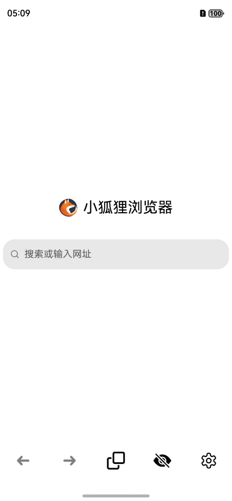
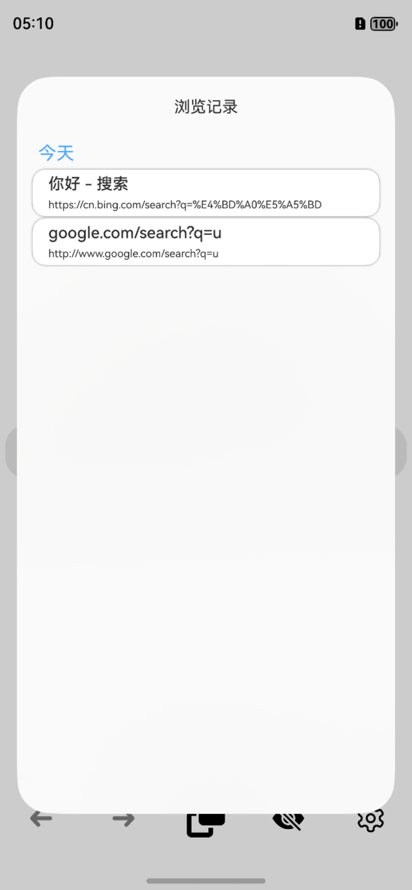
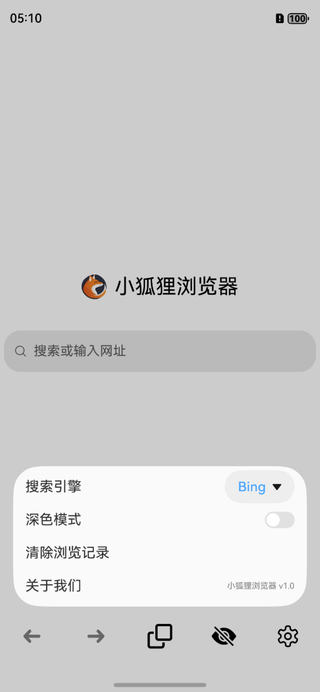

# ArkTS制作鸿蒙系统的纯净浏览器（小狐狸浏览器）

本项目是基于**DevEco Studio**开发的，基于**鸿蒙系统**的**纯净浏览器**。非常适合刚学习**ArkTS**的**新人朋友**们学习和参考。

<!-- PROJECT SHIELDS -->

[![Contributors][contributors-shield]][contributors-url]
[![Forks][forks-shield]][forks-url]
[![Stargazers][stars-shield]][stars-url]
[![Issues][issues-shield]][issues-url]
[![MIT License][license-shield]][license-url]
[![LinkedIn][linkedin-shield]][linkedin-url]

<!-- PROJECT LOGO -->
<br />

<p align="center">
  <a href="https://github.com/langwudong/browser/">
    
  </a>

  <h3 align="center">ArkTS制作鸿蒙系统的纯净浏览器</h3>
  <p align="center">
    欢迎测试、学习以及交流
    <br />
    <a href="https://github.com/langwudong/browser"><strong>探索本项目的文档 »</strong></a>
    <br />
    <br />
    <a href="https://github.com/langwudong/browser">查看Demo</a>
    ·
    <a href="https://github.com/langwudong/browser/issues">报告Bug</a>
    ·
    <a href="https://github.com/langwudong/browser/issues">提出新特性</a>
  </p>

</p>
 
## 目录

- [示意截图](#示意截图)
- [上手指南](#上手指南)
  - [安装](#安装)
- [文件目录说明](#文件目录说明)
- [开发的架构](#开发的架构)
- [部署](#部署)
- [使用到的框架](#使用到的框架)
- [贡献者](#贡献者)
  - [如何参与开源项目](#如何参与开源项目)
- [版本控制](#版本控制)
- [作者](#作者)
- [鸣谢](#鸣谢)

### 示意截图
<p align="center">
  <a href="https://github.com/langwudong/browser/">
    
  </a>
  <a href="https://github.com/langwudong/browser/">
    
  </a>
  <a href="https://github.com/langwudong/browser/">
    
  </a>
</p>

### 上手指南

你需要在你的设备上安装**DevEco Studio**，并且配置相应的**Node.js**环境。该项目的主要文件在**entry/src/main/ets**中。

#### 安装

克隆本仓库
```sh
git clone https://github.com/langwudong/browser.git
```

### 文件目录说明
eg:

```
primary filetree 
├─AppScope
│  └─resources
│      └─base
│          ├─element
│          └─media
├─entry
│  └─.preview
│     └─cache
│        └─entry
│           └─src
│               └─main
│                   └─ets
│                       ├─Buttons
│                       ├─common
│                       │  ├─bean
│                       │  └─constants
│                       ├─entryability
│                       ├─model
│                       ├─pages
│                       └─view
└─src
   └─main
      ├─ets
      │  ├─common
      │  │  ├─bean
      │  │  └─constants
      │  ├─entryability
      │  ├─model
      │  ├─pages
      │  └─view
      └─resources
          ├─base
          │  ├─element
          │  ├─media
          │  └─profile
          ├─en_US
          │  └─element
          ├─rawfile
          └─zh_CN
              └─element

```


### 开发的架构 

暂无

### 部署

暂无

### 使用到的框架

暂无

### 贡献者

- [朗 吾 東](https://github.com/langwudong)

#### 如何参与开源项目

贡献使开源社区成为一个学习、激励和创造的绝佳场所。你所作的任何贡献都是**非常感谢**的。


1. Fork the Project
2. Create your Feature Branch (`git checkout -b feature/AmazingFeature`)
3. Commit your Changes (`git commit -m 'Add some AmazingFeature'`)
4. Push to the Branch (`git push origin feature/AmazingFeature`)
5. Open a Pull Request


### 版本控制

该项目使用Git进行版本管理。您可以在repository参看当前可用版本。

### 作者

langwudong@yeah.net

B站: [Nancy朗吾東](https://space.bilibili.com/456674958?spm_id_from=333.1007.0.0)

知乎: [朗 吾 東](https://www.zhihu.com/people/---60-9-44)  &ensp; qq: 63265742

*欢迎添加我的联系方式交流学习*

*您也可以在贡献者名单中参看所有参与该项目的开发者。*

### 版权说明

该项目由个人原创，你可以**下载**该项目进行**学习**。

### 鸣谢


感谢各位朋友的积极反馈

<!-- links -->
[your-project-path]:langwudong/browser
[contributors-shield]: https://img.shields.io/github/contributors/langwudong/browser.svg?style=flat-square
[contributors-url]: https://github.com/langwudong/browser/graphs/contributors
[forks-shield]: https://img.shields.io/github/forks/langwudong/browser.svg?style=flat-square
[forks-url]: https://github.com/langwudong/browser/network/members
[stars-shield]: https://img.shields.io/github/stars/langwudong/browser.svg?style=flat-square
[stars-url]: https://github.com/langwudong/browser/stargazers
[issues-shield]: https://img.shields.io/github/issues/langwudong/browser.svg?style=flat-square
[issues-url]: https://img.shields.io/github/issues/langwudong/browser.svg
[license-shield]: https://img.shields.io/github/license/shaojintian/Best_README_template.svg?style=flat-square
[license-url]: https://github.com/langwudong/browser/blob/master/LICENSE.txt
[linkedin-shield]: https://img.shields.io/badge/-LinkedIn-black.svg?style=flat-square&logo=linkedin&colorB=555
[linkedin-url]: https://linkedin.com/in/langwudong
